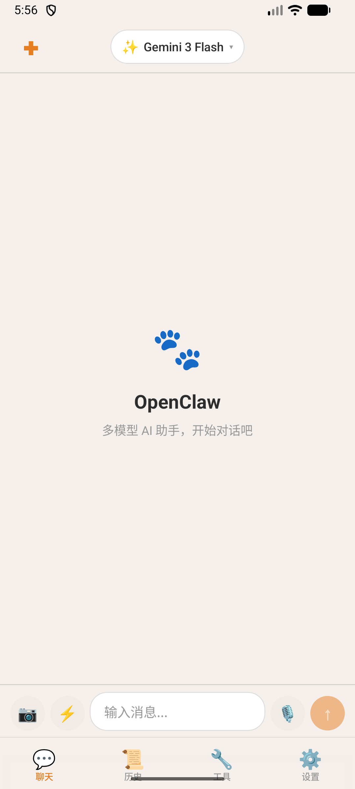
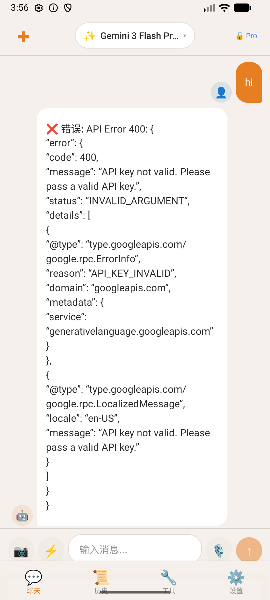
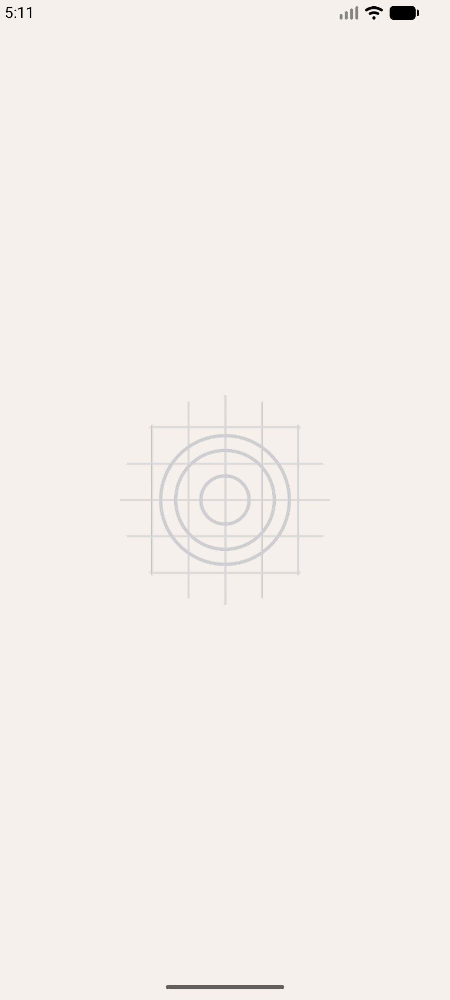
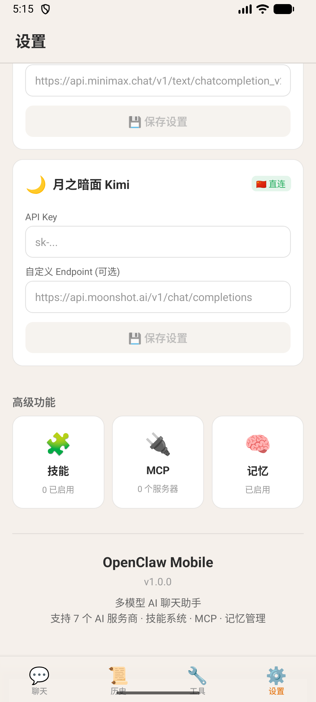
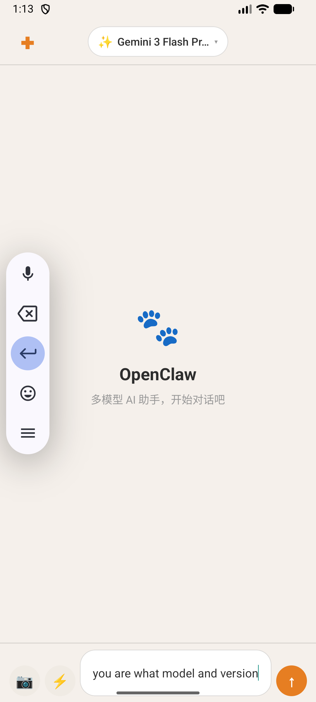
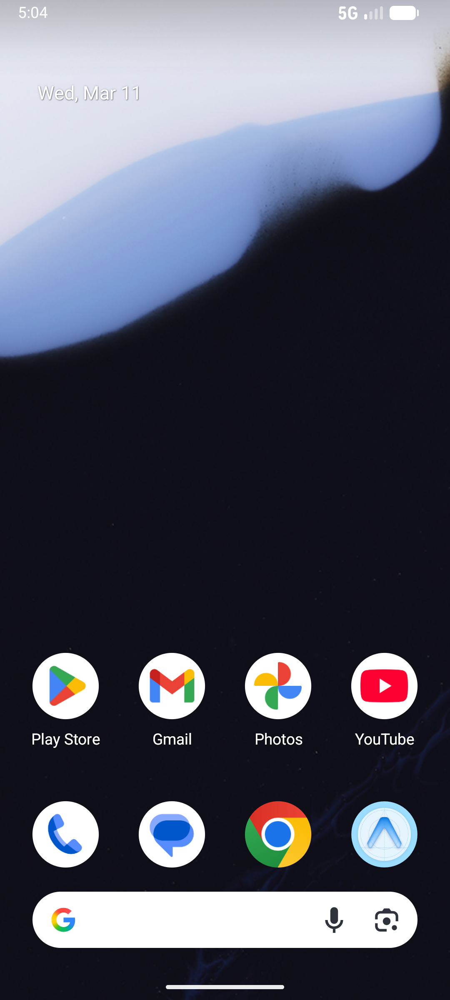

# 🐾 Mobile OpenClaw

A multi-model AI chat assistant for Android, iPad & iPhone — built with Expo (React Native) + TypeScript.

Connect to **7 AI providers** with a single app. Switch models on the fly, stream responses in real-time, and keep your conversations organized.

<p align="center">
  
  
  
  
</p>

## ✨ Features

### Multi-Provider AI Chat
- **OpenAI** — GPT-5.2, GPT-5.1, GPT-5 Mini, GPT-4.1, GPT-4o
- **Google Gemini** — Gemini 3.1 Pro, Gemini 3 Flash, Gemini 2.5 Pro/Flash
- **Anthropic Claude** — Claude Opus 4.6, Sonnet 4.6, Haiku 4.5
- **DeepSeek** — DeepSeek-V3, DeepSeek-R1
- **通义千问 Qwen** — Qwen Max/Plus/Turbo, Qwen VL (Vision)
- **MiniMax** — MiniMax M2.5, M1
- **月之暗面 Kimi** — Kimi K2.5, K2 Thinking, Moonshot V1

### Core Capabilities
- 🔄 **Real-time Streaming** — Token-by-token response streaming via SSE
- 📷 **Vision AI** — Send images for analysis (providers that support it)
- 💬 **Chat History** — Persistent conversation storage with search
- 🎨 **Dark/Light Theme** — Automatic or manual theme switching
- 📱 **Responsive Layout** — Adaptive UI for phones and tablets
- 🔧 **Custom Endpoints** — Use your own API endpoints or proxies
- 📋 **Markdown Rendering** — Code blocks, tables, lists, and more
- 🗣️ **Text-to-Speech** — Read responses aloud
- 📎 **Export & Share** — Share conversations as text

### Built-in Tools
- 🔍 Web Search
- 🌐 Translator
- 💻 Code Runner
- 🎨 Image Generation
- 🔐 Password Generator

## 🏗️ Tech Stack

| Layer | Technology |
|-------|-----------|
| Framework | [Expo](https://expo.dev/) SDK 55 |
| UI | [React Native](https://reactnative.dev/) 0.83 |
| Language | TypeScript 5.9 |
| State | [Zustand](https://github.com/pmndrs/zustand) 5 |
| Storage | AsyncStorage |
| Navigation | Expo Router (file-based) |
| Animations | React Native Reanimated 4 |

## 📁 Project Structure

```
mobile-openclaw/
├── app/                    # Expo Router pages
│   ├── (tabs)/             # Tab navigation
│   │   ├── index.tsx       # Main chat screen
│   │   ├── history.tsx     # Chat history
│   │   └── settings.tsx    # Provider & app settings
│   ├── chat/               # Chat detail routes
│   └── _layout.tsx         # Root layout
├── src/
│   ├── components/         # Reusable UI components
│   │   ├── ChatBubble.tsx  # Message bubble with markdown
│   │   ├── ChatInput.tsx   # Input bar with image picker
│   │   ├── ModelSelector.tsx
│   │   └── ...
│   ├── providers/          # AI provider implementations
│   │   ├── base.ts         # Abstract provider + registry
│   │   ├── gemini.ts       # Google Gemini (custom API)
│   │   ├── openai.ts       # OpenAI-compatible
│   │   ├── claude.ts       # Anthropic Claude
│   │   └── ...             # deepseek, qwen, minimax, moonshot
│   ├── store/              # Zustand state management
│   │   ├── chatStore.ts    # Messages & conversations
│   │   └── settingsStore.ts # Provider keys & preferences
│   ├── tools/              # Built-in tool implementations
│   ├── theme/              # Dark/light theme definitions
│   ├── types/              # TypeScript interfaces
│   └── utils/              # Layout helpers, etc.
├── assets/                 # Icons, splash screen
├── builds/                 # Pre-built APK files
└── app.json                # Expo configuration
```

## 🚀 Getting Started

### Prerequisites

- [Node.js](https://nodejs.org/) 18+
- At least one AI provider API key

**For Android:**
- [Java JDK 17](https://adoptium.net/)
- [Android Studio](https://developer.android.com/studio) with SDK 36

**For iOS:**
- macOS with [Xcode](https://developer.apple.com/xcode/) 15+
- [CocoaPods](https://cocoapods.org/) (`sudo gem install cocoapods`)
- Apple Developer account (for device testing)

### Install & Run

```bash
# Clone the repository
git clone https://github.com/your-username/mobile-openclaw.git
cd mobile-openclaw

# Install dependencies
npm install --legacy-peer-deps
```

### Android

```bash
# Start Expo dev server
npx expo start

# Or run directly on Android
npx expo run:android
```

**Build APK:**

```bash
# Bundle JavaScript
npx expo export:embed \
  --platform android --dev false \
  --entry-file index.ts \
  --bundle-output android/app/src/main/assets/index.android.bundle \
  --assets-dest android/app/src/main/res

# Build debug APK (arm64)
cd android && ./gradlew assembleDebug -PreactNativeArchitectures=arm64-v8a
```

### iOS (iPad & iPhone)

```bash
# Generate iOS native project
npx expo prebuild --platform ios

# Install CocoaPods dependencies
cd ios && pod install && cd ..

# Run on iOS simulator
npx expo run:ios

# Or run on a specific simulator
npx expo run:ios --device "iPad Pro (13-inch)"
npx expo run:ios --device "iPhone 16 Pro"
```

**Build IPA (for device):**

```bash
# Open in Xcode
open ios/OpenClaw.xcworkspace

# In Xcode:
# 1. Select your Team in Signing & Capabilities
# 2. Select target device
# 3. Product → Build (⌘B)
# 4. Product → Run (⌘R)
```

> 💡 iPad supports landscape orientation and all modals display as centered popups for a better tablet experience.

## ⚙️ Configuration

1. Open the app → **Settings** tab
2. Expand any AI provider card
3. Enter your **API Key**
4. (Optional) Set a custom endpoint
5. Select your preferred model
6. Start chatting!

> 💡 API keys are stored locally on your device using AsyncStorage. They are never sent to any server other than the AI provider's API endpoint.

## 📸 Screenshots

| Home | Chat | History | Models |
|------|------|---------|--------|
|  |  |  |  |

## 🗺️ Roadmap

- [x] Multi-provider AI chat with streaming
- [x] Vision AI (image analysis)
- [x] Chat history & search
- [x] Dark/Light theme
- [x] Responsive tablet layout
- [x] Built-in tools (search, translate, code run)
- [x] iOS (iPad & iPhone) support
- [ ] MCP (Model Context Protocol) integration
- [ ] Voice input
- [ ] Conversation export (PDF/Markdown)

## 📄 License

This project is for personal/educational use.

---

<p align="center">
  Built with ❤️ using <a href="https://expo.dev/">Expo</a> + <a href="https://reactnative.dev/">React Native</a>
</p>
